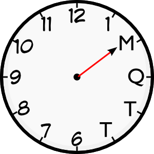

# mqtt-chronos

_mqtt-chronos_ periodically publishes time information to an [MQTT] broker, on a topic branch of your chosing (default: `/system/nodename/chronos/`). Long-lived time data (e.g. weekday, year, etc.) are published with a _retain_ flag set, whereas short-lived periods (minutes, second) are published without.

## Usage

_mqtt-chronos_ understands the following options:

* `-h` specify the hostname or IP address to connect to. Default is `localhost`.
* `-p` specify the TCP port number of the MQTT broker. Default is `1883`.
* `-i` specify an interval in seconds (mininum: 1) to publish information. Default: 10.
* `-t` specify a topic branch prefix. Up to three occurances of `%s` are replaced by the system's node name. Default: `/system/%s/chronos`.
* `-C` specify the path to a PEM-encoded CA certificate for connecting to a broker over TLS.
* `-U` use UTC (default: True)
* `-L` use localtime (default: False)
* `-K` use TLS PSK. This is the key string
* `-I` use TLS PSK. This is the identity string

## Example

## Note

* _mqtt-chronos_ publishes a non-retained topic `uptime` specifying for how long it has been up; the value is in seconds.
* Specifying both `-U` and `-L` effectively disable all time publishes except `uptime`. This is a feature. :-)

  [mqtt]: http://mqtt.org
  [mosquitto]: http://mosquitto.org
